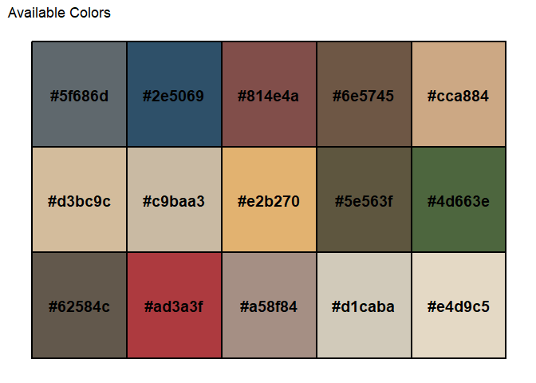

## Introduction


Just some fun color palettes based on Fallingwater and Taliesin by Frank
Lloyd Wright.

## Installation

Install franklloydwright with:

``` r
# install.packages("devtools")
devtools::install_github("sccallahan/franklloydwright")
```

## Usage

The package is just two functions: one that shows the full palettes, and
one that makes sub-palettes.

We can see the entire original palette, along with the relevant hex
codes, so we can choose which color to base the new sub-palette on:

``` r
library(franklloydwright)
show_all_colors_flw(palette_name = 'fallingwater')
```

<!-- -->

We can then generate a sub-palette ‘centered’ on a particular color. The
sub-palette is generated by taking the input color and finding all
colors that ‘touch’ this color on the original palette.

``` r
palette <- generate_palette_flw("fallingwater", "#ad3a3f")
```

We can then call the object name to see the generated sub-palette as a
plot in the larger context of the original palette, as well as display
the hex codes in the R console:

``` r
palette
#> [1] "#62584c" "#ad3a3f" "#a58f84" "#d3bc9c" "#c9baa3" "#e2b270"
#> attr(,"plot")
```

<!-- -->

This sub-palette can then be used like any other color palette for
various plots. As a toy example:

``` r
library(ggplot2)
#> Warning: package 'ggplot2' was built under R version 4.2.3
df <- data.frame(
  category = LETTERS[1:5],
  value = c(3, 7, 4, 6, 2)
)

# Generate palette from selected color
palette <- generate_palette_flw("fallingwater", "#ad3a3f")

# Use palette in a barplot
ggplot(df, aes(x = category, y = value, fill = category)) +
  geom_bar(stat = "identity") +
  scale_fill_manual(values = palette) +
  theme_minimal()
```

<!-- -->
